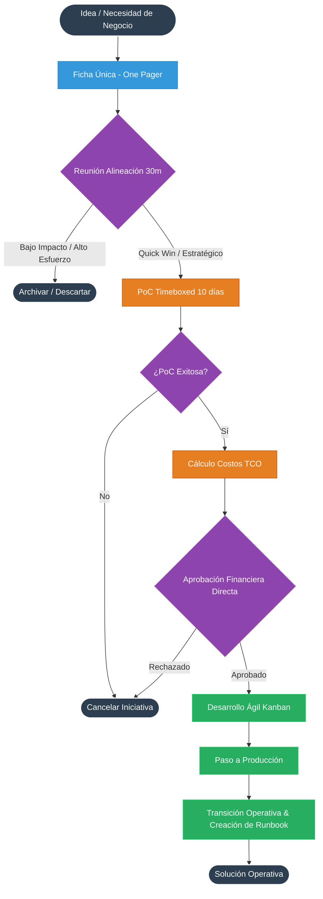

# 🚀 Framework 'Lean AI' para PyMEs: Ciclo de Vida de Casos de Uso

Bienvenido al repositorio de documentación del proceso de adopción, desarrollo y despliegue de soluciones de Inteligencia Artificial enfocado en la agilidad operativa para Pequeñas y Medianas Empresas (PyMEs).

Este marco de trabajo reemplaza la pesada burocracia corporativa por **controles rápidos, consolidación de roles y priorización inteligente**, asegurando que solo las iniciativas con mayor impacto y factibilidad consuman recursos técnicos.

---

## 👥 1. Consolidación de Roles

Para mantener la agilidad, los roles tradicionales se consolidan en tres figuras clave:

| Rol Simplificado | Equivalente Corporativo | Responsabilidades |
| :--- | :--- | :--- |
| **Product & Business Owner** | Negocio, Finanzas, Sponsor | Identifica la necesidad mediante una *Ficha Única*, evalúa el impacto de negocio, y aprueba el presupuesto/ROI. |
| **Líder Técnico de IA** | Arquitecto, Data Scientist, Ciberseguridad | Evalúa la viabilidad técnica, disponibilidad de datos, riesgos de seguridad y estima costos de APIs/Cloud. |
| **Desarrollador / DevOps** | Dev, QA, MLOps, Soporte TI | Ejecuta la Prueba de Concepto (PoC), integra, despliega y documenta la operación (Soporte Nivel 2). |

---

## 🎯 2. Matriz de Priorización de Casos de Uso

Antes de invertir tiempo en desarrollo o pruebas técnicas, toda idea debe pasar por una reunión de alineación de 30 minutos y ubicarse en la matriz de priorización basada en dos ejes: **Impacto/Valor (Retorno)** y **Esfuerzo/Dificultad (Factibilidad)**.

*   🟢 **Cuadrante 1: Ganancias Rápidas (Quick Wins)** - *[Alto Impacto / Bajo Esfuerzo]*: Pasan directamente a la Fase de PoC. Generalmente usan modelos pre-entrenados o APIs existentes (ej. OpenAI, Anthropic).
*   🔵 **Cuadrante 2: Proyectos Estratégicos** - *[Alto Impacto / Alto Esfuerzo]*: Requieren planificación. Suelen implicar preparación de datos propia (Fine-tuning o RAG complejo). Se agendan para el futuro.
*   🟡 **Cuadrante 3: Tareas Menores** - *[Bajo Impacto / Bajo Esfuerzo]*: Automatizaciones sencillas. Se delegan o se hacen si hay capacidad ociosa en el equipo técnico.
*   🔴 **Cuadrante 4: Descartar** - *[Bajo Impacto / Alto Esfuerzo]*: Se archivan inmediatamente.

---

## 🔄 3. El Flujo End-to-End (Las 3 Fases)

### Fase 1: Entrada y Filtro Express (1-2 días)
1. **Ideación:** El Product Owner llena una "Ficha Única" (One-Pager) con el problema, el KPI a mejorar y los datos disponibles.
2. **Filtro / Matriz:** Reunión de 30 min con el Líder Técnico. Se ubica el caso en la matriz de priorización. Si es Quick Win, avanza.

### Fase 2: PoC Timeboxed y Aprobación Financiera (1-2 semanas)
3. **Prueba de Concepto (PoC):** El Desarrollador tiene un límite de 10 días para probar llamadas a APIs comerciales con datos reales (Fail-Fast).
4. **Estimación y GO/NO-GO:** El Líder Técnico estima el costo recurrente (TCO mensual). El Product Owner aprueba directamente el presupuesto sin comités.

### Fase 3: Construcción, Despliegue y Auto-Soporte (2-4 semanas)
5. **Desarrollo Ágil:** Iteraciones bajo un tablero Kanban.
6. **Paso a Producción:** Despliegue con control de límites de consumo.
7. **Transición Operativa:** Creación de un *Runbook* de soporte por parte del Desarrollador para que el negocio opere la herramienta.

---

## 📊 4. Diagramas de Proceso (Mermaid)

> *Nota: GitHub renderizará automáticamente estos bloques de código como diagramas.*

### Flujograma Formal: Ciclo de Vida Lean AI

```mermaid
flowchart TD
    classDef start_end fill:#2c3e50,stroke:#fff,stroke-width:2px,color:#fff
    classDef phase1 fill:#3498db,stroke:#2980b9,color:#fff
    classDef phase2 fill:#e67e22,stroke:#d35400,color:#fff
    classDef phase3 fill:#27ae60,stroke:#2ecc71,color:#fff
    classDef decision fill:#8e44ad,stroke:#9b59b6,color:#fff

    A([Idea / Necesidad de Negocio]) ::: start_end --> B[Ficha Única - One Pager] ::: phase1
    B --> C{Reunión Alineación 30m} ::: decision
    C -->|Bajo Impacto / Alto Esfuerzo| Z([Archivar / Descartar]) ::: start_end
    C -->|Quick Win / Estratégico| D[PoC Timeboxed 10 días] ::: phase2
    
    D --> E{¿PoC Exitosa?} ::: decision
    E -->|No| Y([Cancelar Iniciativa]) ::: start_end
    E -->|Sí| F[Cálculo Costos TCO] ::: phase2
    
    F --> G{Aprobación Financiera Directa} ::: decision
    G -->|Rechazado| Y
    G -->|Aprobado| H[Desarrollo Ágil Kanban] ::: phase3
    
    H --> I[Paso a Producción] ::: phase3
    I --> J[Transición Operativa & Creación de Runbook] ::: phase3
    J --> K([Solución Operativa]) ::: start_end
```

### Diagrama de Secuencia


